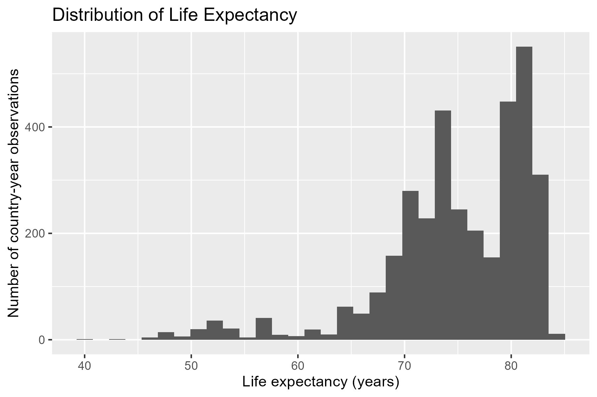
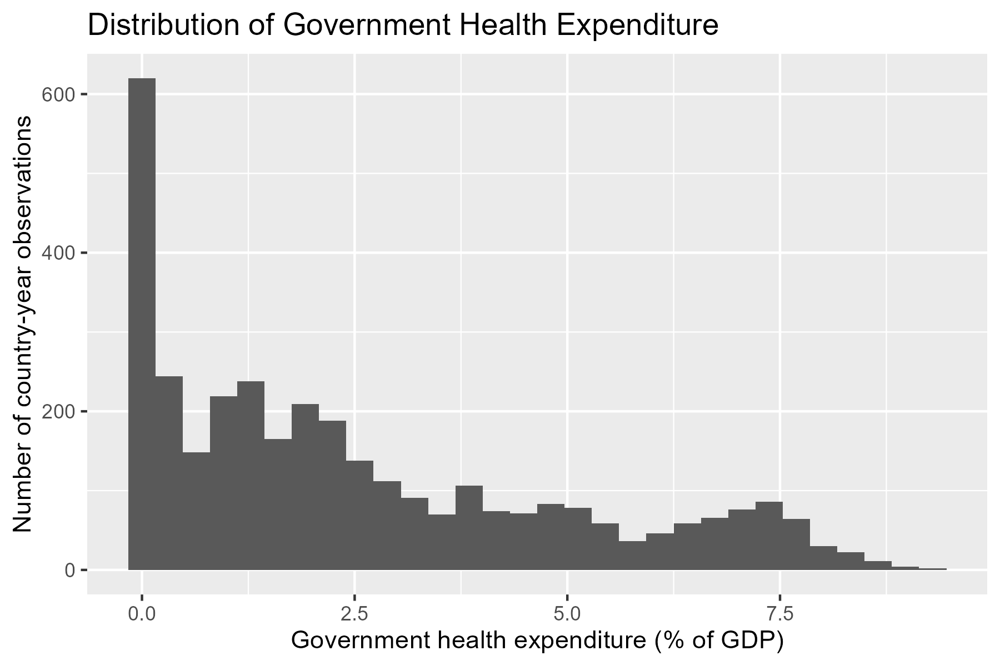
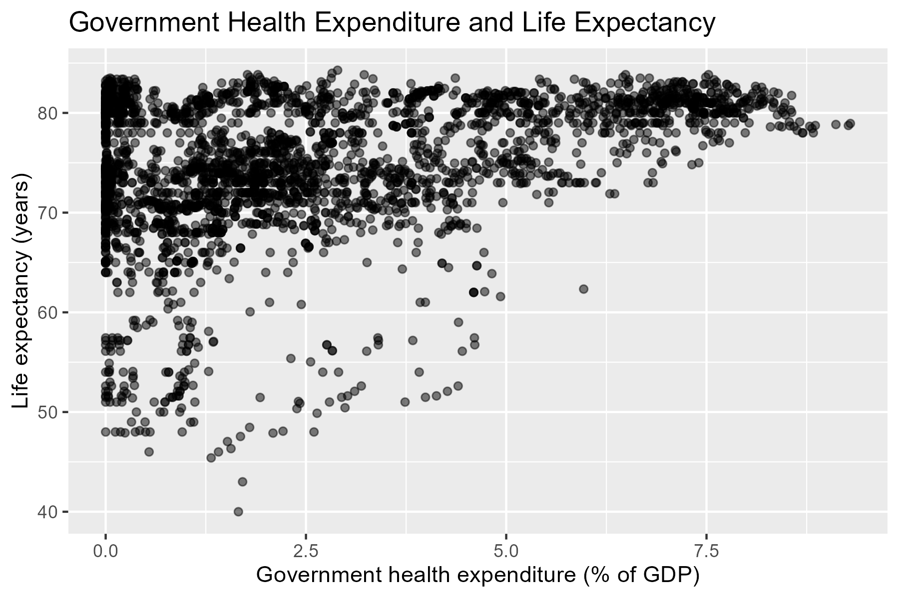
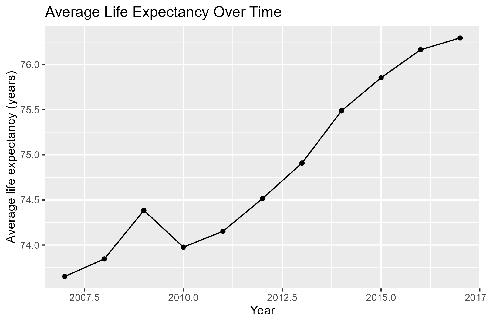

## Research Question and Hypotheses

Health is a fundamental part of human well-being and an important concern for individuals, governments, and public policy. The World Health Organization defines health as “a state of complete physical, mental and social well-being and not merely the absence of disease or infirmity” [@who_health_definition]. However, health outcomes are shaped by many factors, including income, education, social and physical environments, and access to health services [@canada_health_determinants]. Therefore, understanding how public healthcare investment relates to population health outcomes is an important question.

### Research Question

This project examines the relationship between government healthcare expenditure and life expectancy across countries between 2007 and 2017. Our main research question is:

**How does government healthcare expenditure relate to life expectancy across countries between 2007 and 2017?**

In this project, we use life expectancy as a broad measure of population health because it reflects how long people are expected to live under current mortality conditions. We focus on government healthcare expenditure as a percentage of GDP because it reflects the share of national economic resources that governments allocate to healthcare systems. Together, these two variables allow us to explore whether countries that devote a larger share of GDP to public healthcare tend to have better population health outcomes.

### Hypotheses

Based on this research question, our main hypothesis is:

**H1: Countries with higher government healthcare expenditure as a percentage of GDP tend to have higher life expectancy.**

This hypothesis is based on the expectation that greater public healthcare spending may improve access to healthcare services, disease prevention, treatment quality, and overall health system capacity. These improvements may contribute to better population health outcomes and longer life expectancy.

However, we also recognize that life expectancy is influenced by many factors beyond healthcare expenditure, including income levels, education, sanitation, nutrition, lifestyle, and healthcare system efficiency. Therefore, this project examines the association between healthcare expenditure and life expectancy, rather than claiming a direct causal relationship.

## Dataset and Methods

### Dataset

This project combines two publicly available datasets obtained through World Bank Data360 [@worldbank_health; @worldbank_lifeexpect].The first dataset, IMF Government Expenditure on Health (IMF_COFOG_GEL_GF07), contains information on government healthcare expenditure as a percentage of GDP for countries around the world. The second dataset, WEF Life Expectancy (WEF_GCIHH_LIFEEXPECT), provides country-level measures of life expectancy in years.

The two datasets were merged using country and year identifiers. The final dataset covers the period from 2007 to 2017 and uses country-year observations as the unit of analysis, meaning that each row represents one country in one year. The main explanatory variable is government healthcare expenditure as a percentage of GDP, while the main outcome variable is life expectancy measured in years.

The dataset includes substantial variation across countries and over time, making it suitable for examining differences in health outcomes and public spending. However, several limitations should be acknowledged. First, the analysis is limited to countries and years for which both datasets contain observations. Second, healthcare expenditure and life expectancy may be influenced by additional factors such as economic development, education, healthcare access, and demographic characteristics that are not included in the current dataset. Finally, differences in reporting practices across countries may affect comparability.

### Methods

This project will use exploratory and descriptive data analysis to examine the relationship between government healthcare expenditure and life expectancy. Summary statistics, including measures of central tendency and distribution, will be used to understand the characteristics of the dataset. Data cleaning, merging, and visualization were conducted in R using the tidyverse package collection [@RCoreTeam; @wickham2019].

Several visualizations will be created to explore patterns in the data. Histograms will be used to examine the distributions of healthcare expenditure and life expectancy. A scatterplot will be used to investigate the relationship between the two variables and assess whether countries with higher healthcare expenditure tend to have higher life expectancy. A line graph will also be used to examine changes in average life expectancy over time.

In the final project, we may additionally apply a simple linear regression model to further examine the association between government healthcare expenditure and life expectancy. These methods are appropriate because they directly address the research question by allowing us to explore variation across countries and identify potential relationships between public health spending and health outcomes.

## Exploratory Data Analysis

Before examining the relationship between healthcare expenditure and life expectancy, we first summarized the key variables in the merged dataset. The final dataset uses country-year observations as the unit of analysis, meaning each row represents one country in one year between 2007 and 2017. The two main variables of interest are life expectancy, measured in years, and government health expenditure, measured as a percentage of GDP. These variables directly correspond to our research question because life expectancy is the main health outcome, while government health expenditure is the main explanatory variable.

The dataset shows substantial variation in both variables. Life expectancy ranges from relatively low values below 60 years in some country-year observations to above 80 years in others, suggesting major cross-national differences in population health. Government health expenditure is also unevenly distributed, with many country-year observations concentrated at lower spending levels and fewer observations at higher levels. This variation is important because it allows us to explore whether countries that allocate a larger share of GDP to health tend to have higher life expectancy.

### Figure 1: Distribution of Life Expectancy

Figure 1 shows the distribution of life expectancy across all country-year observations. Most observations fall between approximately 65 and 85 years, with a large concentration around 75–83 years. However, there are a small number of observations below 60 years, indicating substantial differences in health outcomes across countries. This variation suggests that life expectancy may be influenced by broader social and economic factors, making it a useful outcome variable for this study.

### Figure 2: Distribution of Government Health Expenditure

Figure 2 presents the distribution of government healthcare expenditure as a percentage of GDP. The distribution is strongly right-skewed, with many observations concentrated at lower levels of spending and fewer countries reporting very high levels of expenditure. This suggests considerable variation in how governments allocate resources to healthcare. Such variation provides an opportunity to examine whether differences in spending are associated with differences in life expectancy.

### Figure 3: Relationship Between Government Health Expenditure and Life Expectancy

Figure 3 shows the relationship between government healthcare expenditure and life expectancy. A general positive association can be observed, as countries with higher healthcare expenditure tend to have higher life expectancy. However, the relationship is not perfectly linear. Some countries with similar levels of expenditure display different life expectancy outcomes, suggesting that factors beyond healthcare spending may also influence population health. However, the overall pattern provides preliminary support for our hypothesis that higher healthcare expenditure is associated with longer life expectancy.

### Figure 4: Average Life Expectancy Over Time

Figure 4 illustrates the average life expectancy across all countries from 2007 to 2017. The trend shows a gradual increase over time, rising from approximately 73.7 years in 2007 to over 76 years in 2017. This suggests that global health outcomes improved during the study period. Because life expectancy increased over time, temporal factors may also play a role in explaining health outcomes and should be considered when interpreting the relationship between healthcare expenditure and life expectancy.

Overall, the exploratory analysis reveals substantial variation in both healthcare expenditure and life expectancy across countries. The scatterplot suggests a positive relationship between the two variables, while the time-series analysis indicates that life expectancy generally improved between 2007 and 2017. These findings provide initial evidence that healthcare spending may be associated with population health outcomes and justify further investigation in the final project.
